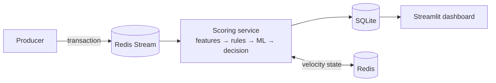

# Real-time Transaction Fraud Monitoring

Real-time monitoring that scores every transaction through a **hybrid of explicit rules and a machine-learning model**, persists each decision, and visualizes the live stream on a dashboard. Transactions flow **one at a time** through the pipeline — like a real anti-fraud system, not a batch CSV filter.

Built on **PaySim** — 6.3M synthetic mobile-money transactions with a realistic **0.13% fraud rate**.

## Architecture



## Pipeline

Each transaction, one at a time:
`features → rules → ML score → decision (allow / review / block) → database → dashboard`

- **Features** — error-balance signals, amount-to-balance ratio, account-drain flag, and incremental **velocity per receiver** (state kept in Redis).
- **Rules** — transparent, independently-logged checks (large amount, full-balance transfer drain, receiver velocity spike).
- **ML** — LightGBM trained offline with class-imbalance handling; only inference runs in the stream.
- **Decision** — combines rule hits and the ML score into allow / review / block with configurable thresholds.

## Model performance

Evaluated with a **time-based split** (train on early hours, test on later hours). A random split would leak future information through the velocity features and inflate the metrics.

| Metric | Value |
|---|---|
| PR-AUC (average precision) | **0.78** |
| Recall @ 0.5 threshold (offline test) | **0.98** (precision 0.86) |
| Live-stream recall (first 1,000 txns) | **30 / 32 frauds flagged (94%)** |

Accuracy and ROC-AUC are deliberately **not** headline metrics: at 0.13% fraud they mislead (a model that flags nothing still scores 99.87% accuracy).

## A note on honesty ("too good to be true")

On PaySim, zeroed balances and the TRANSFER→CASH_OUT pattern let a model reach near-100% — which is not credible. This project avoids that trap with a **time-based split**, **honest metrics** (PR-AUC, recall@precision), and by framing ML as **one signal among rules**, not a silver bullet.

## Tech stack

Python · pandas · LightGBM · Redis (stream + velocity state) · SQLite · Streamlit

## Quickstart

```bash
# 1. Environment
python3 -m venv .venv && source .venv/bin/activate
pip install -r requirements.txt

# 2. Data (downloads PaySim from Kaggle)
python data/download.py

# 3. Train the model
python -m training.train

# 4. Start Redis
brew services start redis

# 5. Stream: emit transactions, then score them
python -m producer.emit
python -m scoring.consumer

# 6. Dashboard
streamlit run dashboard/app.py
```

_One-command startup via `docker-compose up` is on the roadmap._